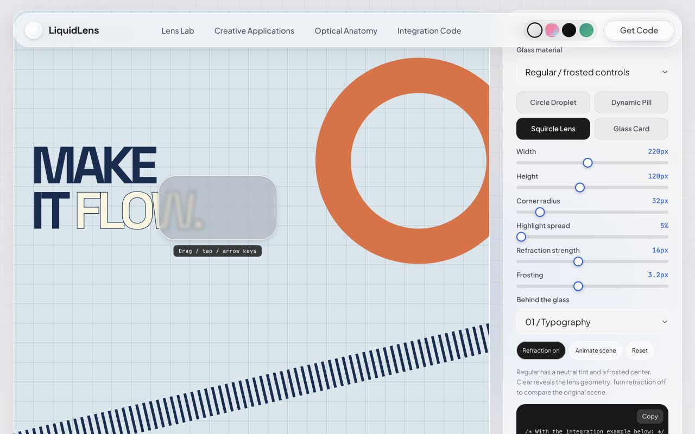
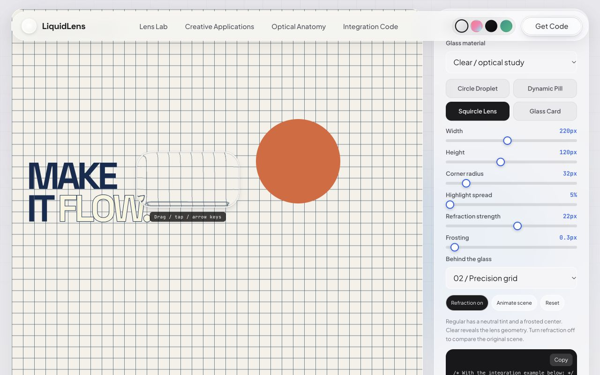

# Verificação do LiquidLens — 04/10/2026

O material foi recalibrado a partir dos dois prints enviados. O modo Regular tem um centro mais neutro e fosco; o modo Clear permite inspecionar a deformação. A separação entre os dois materiais segue as descrições públicas de [materiais da Apple](https://developer.apple.com/design/human-interface-guidelines/materials), e a refração usa uma aproximação do comportamento de [lensing](https://developer.apple.com/videos/play/wwdc2025/219/).

## Detalhes do efeito

| Detalhe | Correção aplicada |
| --- | --- |
| Curvatura | Perfil de borda estreito, calculado pela normal de cada tamanho e raio. A antiga crista senoidal criava uma segunda faixa larga de deformação. |
| Centro | Ampliação discreta, frosting de 3,2 px por padrão e tintura cinza a 28%, com saturação de 0,78. Os valores são uma calibração visual, não parâmetros publicados pela Apple. |
| Ordem das camadas | Cena → atenuação de cor → desfoque → deslocamento → recorte arredondado → tintura e reflexos. Os controles permanecem acima dessas camadas. |
| Reflexos | Menor intensidade, faixa de brilho mais estreita e contorno interno discreto, com luz e sombra em lados diferentes. |
| Cor na borda | Dispersão opcional e discreta. O caminho normal mantém um único deslocamento; separar RGB adiciona dois passes. |
| Registro da imagem | Tamanhos fracionários, bordas e padding entram no cálculo. A cópia acompanha a lente no mesmo paint, inclusive durante arraste coalescido em rAF. |
| Amostragem | A região do filtro inclui somente a margem necessária para refração e desfoque. O recorte final evita cortar antecipadamente os pixels da borda. |

O efeito usa HTML/CSS, JavaScript, Canvas para gerar mapas e filtros SVG para deslocar os pixels. Não usa WebGL. A refração atua em cenas decorativas explícitas; o cabeçalho continua usando backdrop blur. Não há captura de DOM arbitrário ou vídeo.

## Desempenho medido

Comparação local em 414 × 760 CSS px, DPR 2. Cada fase repete a mesma sequência de ações. O teste antigo tinha atualizações globais; o atual limita as atualizações às lentes afetadas. Os tempos abaixo medem codificação de mapas, não todo o custo de renderização.

| Medida | Antes | Depois |
| --- | ---: | ---: |
| Mapas gerados / redimensionamento | 89 | 44 |
| Codificação PNG / redimensionamento (ms) | 154.7 | 13.3 |
| Escritas SVG / redimensionamento | 983 | 312 |
| Leituras de posição / movimento | 240 | 54 |
| Leituras de posição / mudança de forma | 652 | 180 |

O cache tem limite de 48 entradas e 6 MiB de strings, e os mapas usam no máximo cerca de 49 mil pixels. O Canvas usa `willReadFrequently` para evitar leituras repetidas da GPU. Pequenas mudanças de forma codificam mapas a aproximadamente 30 Hz; posição e amostragem continuam seguindo cada quadro. Observadores são compartilhados, cópias invisíveis ficam ocultas, e as leituras de layout precedem as escritas.

Nos testes mobile e desktop, as fases paradas tiveram zero mapas, zero leituras de posição e zero escritas SVG do motor. O próprio benchmark usa rAF para medir os intervalos. A simulação de áudio e a animação do laboratório pausam fora da tela e quando o documento está oculto.

No desktop isolado (1280 × 760), o maior intervalo observado foi 17.7 ms. Isso mede a cadência de rAF no navegador de teste; não é uma medição de tempo de GPU nem uma garantia de FPS em outros dispositivos.

## Validação e limites

As 39 verificações de interação das dez aplicações foram exercitadas a 320, 414, 768 e 1280 px, incluindo presets, teclado, alinhamento das cópias, filtros da galeria, reprodução, mudança de forma, dispersão, ferramentas, notificações, clima, mapa, diálogo, camadas e exportação. Um caso adicional de geometria com padding e `content-box` passou em 414 px (40 verificações nessa tela). O arraste real também foi verificado: diferença de posição e tamanho entre a cena original e a cópia foi zero. IDs, âncoras, recursos locais e sintaxe JavaScript passaram; o exemplo exportado foi aberto sem erros.

O perfil é uma aproximação baseada nos prints. Usa normais de retângulos arredondados e mapas limitados em resolução; não implementa um traçador de raios ou as equações privadas do compositor do macOS. Prints estáticos não demonstram a resposta nativa durante movimento, a adaptação de luminosidade ou todas as variações de material. Escala não uniforme, rotação, perspectiva e cantos assimétricos não são suportados pelo motor.

Os relatórios JSON e as imagens nesta pasta permitem repetir e revisar a verificação. Os testes usaram o navegador integrado do Codex; não equivalem a testes separados em Safari, Chrome e Firefox.

